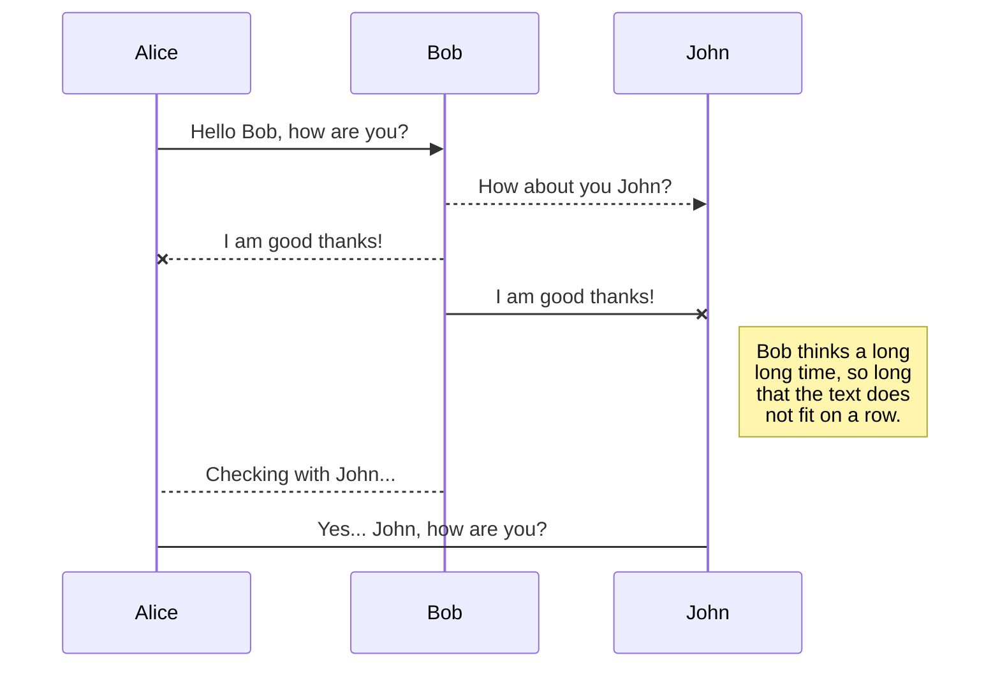
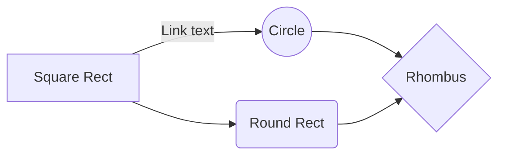

## Installation of PostgreSQL!

During Installation Of PostgreSQL a default user postgres is created for which password is asked during installation and a default port of 5432 is set, while on Linux we have to manually set a password for postgres user.

## Checking the Installation is Success?

In Windows PostgreSQL runs as a service so go to services app and check PostgreSQL is **running**.
Another way of checking is through command line utility _SQL Script(psql)_. Enter the details in the interactive windows to proceed
You can also check the Task manager under Details tab to see if the postmaster is running or not!

## Interacting  in Command line
1. ### ***Commands*** 
* **\l**  - List Databases
* **\q**  - Exit database CLI
* **\d tablename** -shows content of a table 
* **\conninfo** -Shows the connections to a database.
* **\c databasename** - change database
* **\du** - Shows list of users in database with roles(powers)
* * **\dn** - Shows list of Schemas
* **show data_directory;** - which cluster(data) has been initialized
* **show port;** - Shows port on which server has started
* **show parameters;** - Shows parameters details use .conf file to list of available parameters
* **CREATE DATBASE employees OWNER postgres;** - Creates a new database with postgres as owner.(data/base/)
* **DROP DATBASE employees;** - Drops the Database.

2. ### ***Alter Commands***
* **ALTER system set work_mem = '5MB'** 
* **SELECT pg_reload_conf();** 
* **SELECT name,source, boot_val, sourcefile, pending_restart FROM pg_settings WHERE name='max_connections';** -Detailed view of query.
* **SELECT * FROM pg_file_settings;** -Shows conf file difference with current runtime environment.
* **ALTER system RESET all;** - The postgres.auto.conf files changes are resetted.
* **CREATE USER scott LOGIN SUPERUSER PASSWORD 'welcome';** - creates a superuser with password welcome.
* **REVOKE CONNECT on database dbname FROM public;** - Connections settings to a database .
* **SELECT * FROM pg_tables WHERE tablename='tblname';** - Selects all table with given name from global space.
* **GRANT SELECT ON table_name to postgresuser;** -Grants privileges to user(onlyowner or superuser have access)
* **REVOKE SELECT ON table_name FROM postgresuser;** -Takes off privileges the user.
3. ###  ***Client-Server Connection:***
	* psql -U username -h hostname
	* psql -U postgresuser -d databasetoconnect

## Environment Variables

1. Access the bin folder of PostgreSQL in program files and add that in the path of environment variables.
2. PGDATA -> Another import variable which is used start stop and points to data directory.
3. Create Variable PGDATA and copy the path of data directory and paste in the value.

## **Setup PostgreSQL Env variables on Windows**

1. Click on Start -> Search for This PC/My PC -> Right click on This pc -> Select Properties -> Advanced -> Environment Variables.

2. In System Variable window search for path.

3. Select Path and Click Edit.

4.  Click new and copy the location of postgresql bin folder in the new line and click ok.

5. Click option New in the system variable and enter variable name as “PGDATA” and variable value as location of the PostgreSQL data directory.

6. Select okay in all open windows to save & exit out of Environment variable.

## PostgreSQL Architecture
 

1.  Postmaster-Supervisor Process:

	*  Postmaster is the first process which gets started in PostgreSQL

	*  Postmaster acts as supervisor process, whose job is to monitor, start, restart some processes if they die.

	*  Postmaster acts a listener and receive new connection request from the client.

	*  Postmaster is responsible for Authentication and Authorization of all incoming request.

	*  Postmaster spawns a new process call Postgres for each new connection.

2. Utility Process:

	*  Bgwriter\Writer: Periodically writes the dirty buffer to a data file.

	*  Wal Writer: Write the WAL buffer to the WAL file.

	*  Checkpointer: Checkpoint is invoked every 5 minute(default) or when max_wal_size value is exceeded. The check pointer syncs all the buffers from the shared buffer area to the data files.

	*  Auto vacuum: Responsible to carry vacuum operations on bloated tables. (If Enabled).

	*  Statscollector:  Responsible for collection and reporting of information about server activity then update the information to optimizer dictionary((pg_catalog).

	*  Logwriter\Logger: Write the error message to the log file.

	*  Archiver (Optional): When in Archive.log mode, copy the WAL file to the specified directory.

3. Memory Segments of PostgreSQL:

	*  Shared Buffers

	*  Wal Buffers

	*  Clog Buffers

	*  Work Memory

	*  Maintenance Work Memory

	*  Temp Buffers

4. Shared Buffer:

	*  User cannot access the datafile directly to read or write any data.

	*  Any select, insert, update or delete to the data is done via shared buffer area.

	*  The data that is written or modified in this location is called “Dirty data“.

	*  Dirty data is written to the data files located in physical disk through background writer process.

	*  Shared Buffers are controlled by parameter named: shared_buffer located in postgresql.conf file.

5. Wal Buffer:

	*  Write ahead logs buffer is also called as “Transaction log Buffers”.

	*  WAL data is the metadata information about changes to the actual data, and is sufficient to reconstruct actual data during database recovery operations.

	*  WAL data is written to a set of physical files in persistent location called "WAL segments" or "checkpoint segments".

	*  Wal buffers are flushed from the buffer area to wal segments by wal writer.

	*  Wal buffers memory allocation is controlled by the wal_buffers parameter.

6. Clog and other buffers:

	*  CLOG stands for "commit log", and the CLOG buffers is an area in operating system RAM dedicated to hold commit log pages.

	*  The commit logs have commit status of all transactions and indicate whether or not a transaction has been completed (committed).

	*  Work Memory is a memory reserved for either a single sort or hash table (Parameter: Work_mem)

	*  Maintenance Work Memory is allocated for Maintenance work (Parameter: maintenance_work_mem).

	*  Temp Buffers are used for access to temporary tables in a user session during large sort and hash table. (Parameter: temp_buffers).

7. Physical Files:

	*  Data Files: It is a file which is use to store data. It does not contain any instructions or code to be executed.

	*  Wal Files: Write ahead log file, where all transactions are written first before commit happens.

	*  Log Files: All server messages, including stderr, csvlog and syslog are logged in log files.

	*  Archive Logs(Optional): Data from wal segments are written on to archive log files to be used for recovery purpose.

## PostgreSQL Cluster

1. Database Cluster:

	* Database cluster is a collection of databases that is managed by a single instance on a server.

	* Initdb creates a new PostgreSQL database cluster.

	* Creating a database cluster consists of creating the directories in which the data is store. We call this the” data _directory”_.

	* We have to first initialize the storage area on the disk before we begin any operation on the database.

2. Location of Data Directory:

	* Linux:  /var/lib/pgsql/data (Not mandatory)

	* Windows: C:\Program Files\PostgreSQL\12\data (Not mandatory)

3. Initdb:

	* We have to be logged in as PostgreSQL user (Linux) to execute the below commands.

	* There are two way to initialize database.

	* Syntax:

	*  initdb -D /usr/local/pgsql/data(Linux)

	* initdb -D -U postgres /usr/local/pgsql/data(Windows)

	* pg_ctl -D -U postgres /usr/local/pgsql/data initdb

	* -D = refers to the data directory location.

	* -W = we can use this option to force the super user to provide password before initialize db

4. Start\Stop Cluster:

	* Start Cluster Syntax:

		* Linux: systemctl start postgresql-12

		* Windows: pg_ctl –D “C:\Program Files\PostgreSQL\12 \data” start

	* Stop Cluster Syntax:

Linux: systemctl stop postgresql-12

Windows: pg_ctl stop -D “C:\Program Files\Postgresql \12\data” –m shutdown mode

5. Types of Shutdown:

	* Smart: the server disallows new connections, but let’s existing sessions end their work normally. It shuts down only after all of the sessions terminate

	* Fast :( Default): The server disallows new connections and abort their current transactions and exits gracefully.

	* Immediate: Quits/aborts without proper shutdown which lead to recovery on next startup.

6. Difference between Reload and Restart.

	* When we make changes to server parameters, we need to reload the configuration for them to take effect.

	* Reload will just reload the new configurations, without restarting the service.

	* Few configuration changes in server parameters, Do not get reflected until we restart the service.

	* Restart gracefully shutdown all activity, relinquishes the resource, close all open files and start again with new configuration.

7. Reload\Restart Cluster:

	* Syntax for Restart of Cluster:

* On Linux: system reload posgresql-11

* `On windows: pg_ctl reload`

	* Syntax for Reload of Cluster:

* `On Linux: systemctl restart postgresql-11`

* `On Windows: pg_ctl restart`

	* `Psql Command line: SQL: SELECT pg_reload_conf(); (Irrespective of Env)`

* `Pg_Controldata:`

	* `Pg_controldata – Information about cluster.`

* `Syntax:/pg_controldata /var/lib/pgsql/12/data/`

## Database Directory Layout
1. Directory Layout

| **Directory Name** | **Description** |
|----------------|-------------------------------|
|Base | Subdirectory containing per-database subdirectories |
|Current_logfiles | File recording the log file(s) currently written to by the logging collector|
|Global|Subdirectory containing cluster-wide tables, such as pg_database,pg_tablespace,pg_index etc|
|pg_commit_ts|Subdirectory containing transaction commit timestamp data= 9.5 and later, track_commit_timestamp|
|pg_dynshmem|Subdirectory containing files used by the dynamic shared memory subsystem|
|pg_logical|Subdirectory containing status data for logical decoding|
|pg_multixact|Subdirectory containing multitransaction status data (used for shared row locks)|
|pg_notify|Subdirectory containing LISTEN/NOTIFY status data|
pg_replslot|Subdirectory containing replication slot data|
|pg_serial|Subdirectory containing information about committed serializable transactions|
|Log|All error logs kept in this directory.|
|pg_snapshots|Subdirectory containing exported snapshots|
|pg_stat|Subdirectory containing permanent files for the statistics subsystem|
|pg_stat_tmp|Subdirectory containing temporary files for the statistics subsystem|
|pg_subtrans|Subdirectory containing subtransaction status data|
|pg_tblspc|Subdirectory containing symbolic links to tablespaces|
|pg_twophase|Subdirectory containing state files for prepared transactions|
|pg_wal|Subdirectory containing WAL (Write Ahead Log) files|
|pg_xact|Subdirectory containing transaction commit status data, transaction metadata logs|
|Pg_ident.conf|User name maps are defined in the ident map file.user name map can be applied to map the operating system user name to a database user.|
|postgresql.auto.conf|A file used for storing configuration parameters that are set by ALTER SYSTEM|
|postmaster.opts|A file recording the command-line options the server was last started.|
|postmaster.pid|A lock file recording the current postmaster process ID (PID), cluster data directory path, postmaster start timestamp, port number, Unix-domain socket directory path (empty on Windows), first valid listen_address (IP address or *, or empty if not listening on TCP), and shared memory segment ID (this file is not present after server shutdown)|
|PG_VERSION|A file containing the major version number of PostgreSQL|
| | |

2. **Base_Directory:**

* Contains databases, that represented as directories named after their object identifier (OID).

* Template 1 always has oid 1.

* Syntax to find oid of database:

* Select oid, datname from pg_database;

3. **PostgreSQL Default Databases**
* Template0: It is a pristine copy of a template for new databases, The databases should not be modified or any new objects added(No Connection allowed)
* Template1: It is also a template for creating new databases, We Can connect to this database and modify or add objects to this template(Connection allowed)
* We Can use Template0 to create Template1 if corrupted.
* Syntax: CREATE DATABASES newdb TEMPLATE template0;
* Postgres Database: It is a default database used by utilities, users and third party applications.
* The Database itself does not require postgres to function,but many external utilities programs assume it exist.
* When logging with postgres user, it assumes that postgres database exist and connect to the postgres database by default. 
----------------------------------------------------------------------------------------
------------------------------------------------
--------------------------------------------------

### Create Db/User/Schema

1. Create database Psql / createdb utility:

* Syntax from psql: Create database databasename owner ownername;

* Syntax from command line: Createdb <dbname>.

* Syntax for help: createdb --help

* Drop database – Psql/ dropdb utility:

* We can’t drop the database which we are connected.

* Example:
* scott=# drop database scott;

ERROR:  cannot drop the currently open database

* Syntax from psql: Drop database <dbname>.

* Syntax from command line: dropdb <dbname>.

* Syntax for dropdb help: dropdb –help

Create user – Psql/ createuser utility/ Interactive:

* Syntax from psql: create user scott login superuser password 'welcome';

* Syntax from command line: createuser <username>

* Syntax for interactive user creation from command line:

* Example:

* createuser --interactive joe

Shall the new role be a superuser? (y/n) n

Shall the new role be allowed to create databases? (y/n) y

Shall the new role be allowed to create more new roles? (y/n) y

* Syntax for createuser help: createuser --help

Drop user - Psql/ dropuser utility:

* Syntax from psql: drop user <username>

* Syntax from command line: dropuser <username>

* Dropping a user with objects or privileges will return an error.

Example:

postgres=# drop user test1;

ERROR:  role "test1" cannot be dropped because some objects depend on it

* Assign the user privileges to another user before dropping the user.

Example:

REASSIGN OWNED BY user to postgres;

Drop role username;

Grant:

* Grant CONNECT to the database:

GRANT CONNECT ON DATABASE database_name TO username;

* Grant USAGE on schema:

GRANT USAGE ON SCHEMA schema_name TO username;

* Grant on all tables for DML statements: SELECT, INSERT, UPDATE, DELETE

GRANT SELECT, INSERT, UPDATE, DELETE ON ALL TABLES IN SCHEMA schema_name TO username;

* Grant all privileges on all tables in the schema:

GRANT ALL PRIVILEGES ON ALL TABLES IN SCHEMA schema_name TO username;

* Grant all privileges on all sequences in the schema:

GRANT ALL PRIVILEGES ON ALL SEQUENCES IN SCHEMA schema_name TO username;

* Grant permission to create database:

ALTER USER username CREATEDB;

* Make a user superuser:

ALTER USER myuser WITH SUPERUSER;

* Remove superuser status:

ALTER USER username WITH NOSUPERUSER;

* Column Level access:

GRANT SELECT (col1), UPDATE (col1) ON mytable TO user;

Revoke Examples

* Revoke Delete/update privilege on table from user

REVOKE DELETE, UPDATE ON products FROM user;

* Revoke all privilege on table from user

REVOKE ALL ON products FROM user;

* Revoke select privilege on table from all users (Public)

REVOKE SELECT ON products FROM PUBLIC;

Create & Drop Schema

* Create Schema

CREATE schema <schema_name>;

* Create Schema for a user, the schema will also be named as the user

Create schema authorization <username>;

* Create Schema named John, that will be owned by brett

CREATE schema IF NOT EXISTS john AUTHORIZATION brett;

* Drop a Schema

Drop schema <schema_name>;

(We cannot drop schema if there are any object associate with it.)

Schema Search Path:

* Show search path can be used to find the current search path.

Example:

postgres=# show search_path;

search_path

-----------------

"$user", public

( 1 row)

* Default "$user" is a special option that says if there is a schema that matches the current user (i.e SELECT SESSION_USER;), then search within that schema.

* Search path can be set at session level, user level, database level and cluster level

Example:

Test1=# SET search_path TO test1,public;

Test1=# \dt

List of relations

Schema |  Name  | Type  |  Owner

--------+---------+-------+----------

test1  | abc  | table | test1

(1 rows)

 ## 2. ***Schema and its Benefits***
* Schema is a name space that contains named objects(tables,data types,function, and operators).
* One database can have multiple schemas.
* Schemas helps us in seperation of data between different applications.
* Organize database objects into logical geoups to make them more manageable.
* Applications can be put into seperate schemas so that they cannot collide with the name of other objects.
* One database can be used by multiple users without interfering with each other.

<![endif]-->

## Psql Commands

1. ### **Connect to Psql**

* Connect to Specific Database with user and password

Syntax: psql -d database -U user –W (-d =Database, -U = User, -W = Password)

* Connect to Database on a different host/machine.

Syntax: psql -h host -d database -U user –W

* Connect using SSL Mode

Syntax: psql -U user -h host "dbname=db sslmode=require"

2. ### **Psql Commands**

* Switch connection to a new database

postgres=# \c test1

You are now connected to database "test1" as user "postgres".

* List available databases

postgres=# \l

* List available tables

postgres=# \ dt

* List users and their roles(+ to get more info)

postgres=# \du

* List available sequence(+ to get more info)

postgres=# \ds

* Execute the previous command

postgres=# \g

* Command history

postgres=# \s

* Save Command History to file:

postgres=# \s filename

* Get help on psql commands

postgres=# \?

* Turn on\off query execution time

postgres=# _\timing_

* Edit statements in editor

postgres=# \e

* Edit Functions in editor

postgres=# \ef

* set output from non-aligned to aligned column output.

postgres=# _\a_

*  Formats output to HTML format.

postgres=# _\H_

* Connection Information

postgres=# _\conninfo_

* Quit psql

postgres=# _\q_

3. ### *Psql File Operations**

* Run sql statements from a file.

psql -d test1 -U test1 -f test1.sql ( command line)

* Send the output to a file.

postgres=#  \o <filename>

* Save query buffer to filename.

postgres=#  \w filename

* Turn off auto commit on session level

\set AUTOCOMMIT off

## Export a file

You can export the current file by clicking **Export to disk** in the menu. You can choose to export the file as plain Markdown, as HTML using a Handlebars template or as a PDF.

# Synchronization

Synchronization is one of the biggest features of StackEdit. It enables you to synchronize any file in your workspace with other files stored in your **Google Drive**, your **Dropbox** and your **GitHub** accounts. This allows you to keep writing on other devices, collaborate with people you share the file with, integrate easily into your workflow... The synchronization mechanism takes place every minute in the background, downloading, merging, and uploading file modifications.

There are two types of synchronization and they can complement each other:

- The workspace synchronization will sync all your files, folders and settings automatically. This will allow you to fetch your workspace on any other device.
	> To start syncing your workspace, just sign in with Google in the menu.

- The file synchronization will keep one file of the workspace synced with one or multiple files in **Google Drive**, **Dropbox** or **GitHub**.
	> Before starting to sync files, you must link an account in the **Synchronize** sub-menu.

## Open a file

You can open a file from **Google Drive**, **Dropbox** or **GitHub** by opening the **Synchronize** sub-menu and clicking **Open from**. Once opened in the workspace, any modification in the file will be automatically synced.

## Save a file

You can save any file of the workspace to **Google Drive**, **Dropbox** or **GitHub** by opening the **Synchronize** sub-menu and clicking **Save on**. Even if a file in the workspace is already synced, you can save it to another location. StackEdit can sync one file with multiple locations and accounts.

## Synchronize a file

Once your file is linked to a synchronized location, StackEdit will periodically synchronize it by downloading/uploading any modification. A merge will be performed if necessary and conflicts will be resolved.

If you just have modified your file and you want to force syncing, click the **Synchronize now** button in the navigation bar.

> **Note:** The **Synchronize now** button is disabled if you have no file to synchronize.

## Manage file synchronization

Since one file can be synced with multiple locations, you can list and manage synchronized locations by clicking **File synchronization** in the **Synchronize** sub-menu. This allows you to list and remove synchronized locations that are linked to your file.

# Publication

Publishing in StackEdit makes it simple for you to publish online your files. Once you're happy with a file, you can publish it to different hosting platforms like **Blogger**, **Dropbox**, **Gist**, **GitHub**, **Google Drive**, **WordPress** and **Zendesk**. With [Handlebars templates](http://handlebarsjs.com/), you have full control over what you export.

> Before starting to publish, you must link an account in the **Publish** sub-menu.

## Publish a File

You can publish your file by opening the **Publish** sub-menu and by clicking **Publish to**. For some locations, you can choose between the following formats:

- Markdown: publish the Markdown text on a website that can interpret it (**GitHub** for instance),
- HTML: publish the file converted to HTML via a Handlebars template (on a blog for example).

## Update a publication

After publishing, StackEdit keeps your file linked to that publication which makes it easy for you to re-publish it. Once you have modified your file and you want to update your publication, click on the **Publish now** button in the navigation bar.

> **Note:** The **Publish now** button is disabled if your file has not been published yet.

## Manage file publication

Since one file can be published to multiple locations, you can list and manage publish locations by clicking **File publication** in the **Publish** sub-menu. This allows you to list and remove publication locations that are linked to your file.

# Markdown extensions

StackEdit extends the standard Markdown syntax by adding extra **Markdown extensions**, providing you with some nice features.

> **ProTip:** You can disable any **Markdown extension** in the **File properties** dialog.

## SmartyPants

SmartyPants converts ASCII punctuation characters into "smart" typographic punctuation HTML entities. For example:

|---------------------|-----------------|

## KaTeX

You can render LaTeX mathematical expressions using [KaTeX](https://khan.github.io/KaTeX/):

The *Gamma function* satisfying $\Gamma(n) = (n-1)!\quad\forall n\in\mathbb N$ is via the Euler integral

$$
\Gamma(z) = \int_0^\infty t^{z-1}e^{-t}dt\,.
$$

> You can find more information about **LaTeX** mathematical expressions [here](http://meta.math.stackexchange.com/questions/5020/mathjax-basic-tutorial-and-quick-reference).

## UML diagrams

You can render UML diagrams using [Mermaid](https://mermaidjs.github.io/). For example, this will produce a sequence diagram:

And this will produce a flow chart:

